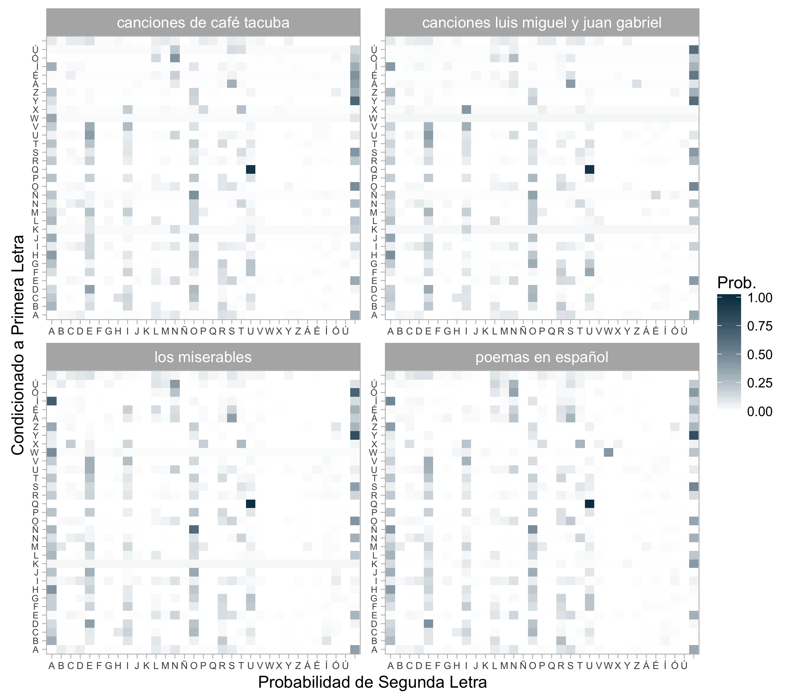

# Decrypting Text in Spanish

#### Decrypting using MCMC

---

#### Final project for the Computational Statictics Course 2016

Team members: M. Godina, S. Mendizábal, V. Montoya

Created: December 2016

Final review: December 2016

---

• Final Video:  
<https://drive.google.com/drive/folders/0B_LXYl5QOPU5T25ZNllTeDVwRVk?usp=sharing>.

#### Introduction

Inspired by the article written by Persi Diaconis
where he presents a text decryption problem solved 
with a simple Metropolis Hastings sampler; this 
project intended to recreate the example building 
a decrypting sampler using MCMC and texts in spanish.

As an additional hypothesis, four different texts were 
considered to construct transition matrices. 
All matrices were similar, and the few differences 
were due to the lack of observations. 

The sampler was created with Shiny and presented in a
video linked at the top of the page. 
The languages used were R and RCpp.

#### Content

* R code in file **src**.

* Transition matrices in file **matriz**.

* Transition matrices graph in file **graphs**.

* Text compilation in file **textos**.

